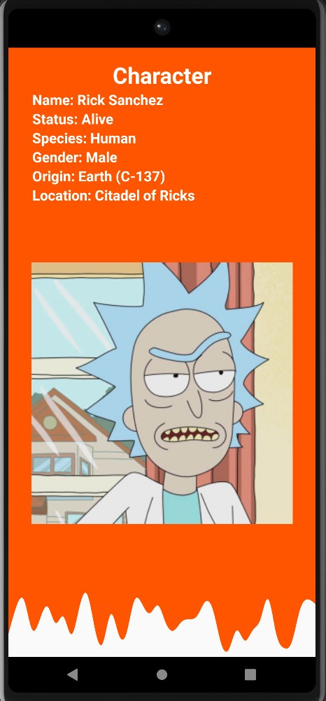

<p align = "center">МИНИСТЕРСТВО НАУКИ И ВЫСШЕГО ОБРАЗОВАНИЯ<br>
РОССИЙСКОЙ ФЕДЕРАЦИИ<br>
ФЕДЕРАЛЬНОЕ ГОСУДАРСТВЕННОЕ БЮДЖЕТНОЕ<br>
ОБРАЗОВАТЕЛЬНОЕ УЧРЕЖДЕНИЕ ВЫСШЕГО ОБРАЗОВАНИЯ<br>
«САХАЛИНСКИЙ ГОСУДАРСТВЕННЫЙ УНИВЕРСИТЕТ»</p>
<br><br><br><br><br><br>
<p align = "center">Институт естественных наук и техносферной безопасности<br>Кафедра информатики<br>Коньков Никита Алексеевич</p>
<br><br><br>
<p align = "center"><br><strong>Лабораторная работа №12.«Каталог персонажей»</strong><br>01.03.02 Прикладная математика и информатика</p>
<br><br><br><br><br><br><br><br><br><br><br><br>
<p align = "right">Научный руководитель<br>
Соболев Евгений Игоревич</p>
<br><br><br>
<p align = "center">г. Южно-Сахалинск<br>2022 г.</p>
<br><br><br><br><br><br><br><br><br><br><br><br>

<h1 align = "center">Введение</h1>

<p><b>Android Studio</b> — интегрированная среда разработки (IDE) для работы с платформой Android, анонсированная 16 мая 2013 года на конференции Google I/O. В последней версии Android Studio поддерживается Android 4.1 и выше.</p>
<p><b>Kotlin</b> — это кроссплатформенный статически типизированный язык программирования общего назначения высокого уровня. Kotlin предназначен для полного взаимодействия с Java, а версия стандартной библиотеки Kotlin для JVM зависит от библиотеки классов Java, но вывод типов позволяет сделать ее синтаксис более кратким. Kotlin в основном нацелен на JVM, но также компилируется в JavaScript (например, для интерфейсных веб-приложений, использующих React) или собственный код через LLVM (например, для собственных приложений iOS, разделяющих бизнес-логику с приложениями Android). Затраты на разработку языка несет JetBrains, а Kotlin Foundation защищает торговую марку Kotlin.</p>

<br>
<h1 align = "center">Цели и задачи</h1>


<p>Требуется разработать мобильное приложение на Kotlin для поиска информации о персонажах из вселенной Рика и Морти.</p>

<p>ФУНКЦИОНАЛЬНЫЕ ТРЕБОВАНИЯ 1:</p>
<ul>
<li>Экран с поисковой строкой</li>
<li>Отображение информации о персонаже (имя, раса, пол, статус)</li>
<li>Вся информация о персонажах задаётся внутри программы</li>
</ul>

<p>ФУНКЦИОНАЛЬНЫЕ ТРЕБОВАНИЯ 2:</p>
<ul>
<li>Отдельный экран с информацией о персонаже</li>
<li>Отображение расширенной информации о персонаже (изображение, родная планета, местоположение)</li>
<li>Вся информация о персонажах задается внутри программы</li>
</ul>

<p>ФУНКЦИОНАЛЬНЫЕ ТРЕБОВАНИЯ 3:</p>
<ul>
<li>Использовать <a href="https://rickandmortyapi.com">RickAndMortyAPI</a> для поддержания актуальности информации о персонажах</li>
</ul>

<p></p>


<h1 align = "center">Решение</h1>

<p>Для выполнения этой лабораторной работы, я пользовался:</p>

<ul>
<li>Материалом из <a href="https://github.com/aakihabara/23_lab8_part_2">ЛР №8_2</a></li>
<li>Материалом из <a href="https://github.com/aakihabara/23_lab11">ЛР №11</a></li>
<li>Материалом из <a href="https://github.com/aakihabara/23_lab_email">дополнительной ЛР "Электронная почта"</a></li>
<li>Материалом в сети интернет</li>
</ul>

<h2 align = "center">Файл Character.kt</h2>

```kotlin
package com.bignerdranch.android.a23_lab12

data class Character(val id: Int,
                     val name: String,
                     val status: String,
                     val species: String,
                     val gender: String,
                     val origin: String,
                     val location: String,
                     var image: String)

var charactersDatas: List<com.bignerdranch.android.a23_lab12.Character>? = null
```

<h2 align = "center">Файл CharacterAdapter.kt</h2>


```kotlin
package com.bignerdranch.android.a23_lab12

import android.view.LayoutInflater
import android.view.View
import android.view.ViewGroup
import android.widget.TextView
import androidx.recyclerview.widget.RecyclerView

class CharacterAdapter(private val characterList: List<CharacterList>) : RecyclerView.Adapter<CharacterAdapter.ViewHolder>() {

    interface CharacterClickListener {
        fun onCharacterClicked(name: String)
    }

    override fun onCreateViewHolder(parent: ViewGroup, viewType: Int): ViewHolder {
        val view = LayoutInflater.from(parent.context).inflate(R.layout.list_item_character, parent, false)
        return ViewHolder(view)
    }

    private var characterClickListener: CharacterClickListener? = null

    fun setCharacterClickListener(listener: CharacterClickListener) {
        characterClickListener = listener
    }


    override fun onBindViewHolder(holder: ViewHolder, position: Int) {
        val character = characterList[position]
        holder.name.text = "Name: " + character.name
        holder.species.text = "Species: " +  character.species
        holder.gender.text = "Gender: " +  character.gender
        holder.status.text = "Status: " +  character.status

        holder.itemView.setOnClickListener {
            characterClickListener?.onCharacterClicked(character.name)
        }
    }

    override fun getItemCount(): Int {
        return characterList.size
    }

    inner class ViewHolder(itemView: View) : RecyclerView.ViewHolder(itemView) {
        val name: TextView = itemView.findViewById(R.id.search_name_field)
        val species: TextView = itemView.findViewById(R.id.search_species_field)
        val gender: TextView = itemView.findViewById(R.id.search_gender_field)
        val status: TextView = itemView.findViewById(R.id.search_status_field)
    }
}

```

<h2 align = "center">Файл CharacterFragment.kt</h2>


```kotlin
package com.bignerdranch.android.a23_lab12

import android.os.Bundle
import android.view.LayoutInflater
import android.view.View
import android.view.ViewGroup
import android.widget.ImageView
import android.widget.TextView
import androidx.fragment.app.Fragment
import com.bumptech.glide.Glide


class CharacterFragment : Fragment()  {


    private lateinit var name: TextView
    private lateinit var status: TextView
    private lateinit var species: TextView
    private lateinit var gender: TextView
    private lateinit var origin: TextView
    private lateinit var location: TextView
    private lateinit var imageField: ImageView

    override fun onCreate(savedInstanceState: Bundle?) {
        super.onCreate(savedInstanceState)
    }

    override fun onCreateView(
        inflater: LayoutInflater,
        container: ViewGroup?,
        savedInstanceState: Bundle?
    ): View? {
        val view = inflater.inflate(R.layout.fragment_character, container, false)
        name = view.findViewById(R.id.name_text) as TextView
        status = view.findViewById(R.id.status_text) as TextView
        species = view.findViewById(R.id.species_text) as TextView
        gender = view.findViewById(R.id.gender_text) as TextView
        origin = view.findViewById(R.id.origin_text) as TextView
        location = view.findViewById(R.id.location_text) as TextView
        imageField = view.findViewById(R.id.image_character) as ImageView

        val cName = arguments?.getString("charName")

        val character = charactersDatas?.find {
            it.name.equals(cName, ignoreCase = true)
        }

        name.text = character?.name
        status.text = character?.status
        species.text = character?.species
        gender.text = character?.gender
        origin.text = character?.origin
        location.text = character?.location
        Glide.with(this).load(character?.image).into(imageField)

        return view
    }
}
```

<h2 align = "center">Файл CharacterList.kt</h2>

```kotlin
package com.bignerdranch.android.a23_lab12

class CharacterList(
    val name: String,
    val species: String,
    val gender: String,
    val status: String
)
```

<h2 align = "center">Файл JSONDownloader.kt</h2>


```kotlin
package com.bignerdranch.android.a23_lab12

import android.content.Context
import android.os.AsyncTask
import org.json.JSONObject
import java.io.BufferedInputStream
import java.io.FileOutputStream
import java.io.InputStream
import java.net.HttpURLConnection
import java.net.URL

class JSONDownloader(private val context: Context, private val callback: JsonDownloadCallback) {

    private val jsonBuilder = StringBuilder()

    fun downloadJsonFile(url: String) {
        JsonDownloadTask().execute(url)
    }

    private inner class JsonDownloadTask : AsyncTask<String, Void, Boolean>() {

        override fun doInBackground(vararg urls: String): Boolean {
            val url = URL(urls[0])
            var connection: HttpURLConnection? = null
            var inputStream: InputStream? = null
            var outputStream: FileOutputStream? = null

            try {
                val file = context.getFileStreamPath("characters.json")
                if (file.exists()) {
                    file.delete()
                }

                var nextPageUrl = url.toString()

                while (nextPageUrl.isNotEmpty()) {
                    connection = URL(nextPageUrl).openConnection() as HttpURLConnection
                    connection.connect()

                    if (connection.responseCode != HttpURLConnection.HTTP_OK) {
                        return false
                    }

                    outputStream = FileOutputStream(file, true)
                    inputStream = BufferedInputStream(connection.inputStream)

                    val buffer = ByteArray(1024)
                    var bytesRead: Int

                    while (inputStream.read(buffer).also { bytesRead = it } != -1) {
                        outputStream.write(buffer, 0, bytesRead)
                        jsonBuilder.append(String(buffer, 0, bytesRead, Charsets.UTF_8))
                    }

                    val jsonData = jsonBuilder.toString()
                    val jsonObject = JSONObject(jsonData)

                    val resultsArray = jsonObject.getJSONArray("results")

                    val existingData = JSONObject(file.readText())
                    val existingResultsArray = existingData.getJSONArray("results")

                    for (i in 0 until resultsArray.length()) {
                        val result = resultsArray.getJSONObject(i)
                        existingResultsArray.put(result)
                    }

                    outputStream.close()
                    outputStream = FileOutputStream(file, false)
                    outputStream.write(existingData.toString().toByteArray())

                    nextPageUrl = getNextPageUrl(jsonData)
                    jsonBuilder.clear()

                    connection.disconnect()
                    inputStream.close()
                    outputStream.close()
                }

                return true
            } catch (e: Exception) {
                return false
            }
        }

        override fun onPostExecute(result: Boolean?) {
            callback.onDownloadComplete()
        }

        private fun getNextPageUrl(jsonData: String): String {
            val json = JSONObject(jsonData)
            val info = json.optJSONObject("info")
            return info?.optString("next", "") ?: ""
        }
    }
}
```

<h2 align = "center">Файл JSONReader.kt</h2>


```kotlin
package com.bignerdranch.android.a23_lab12

import android.content.Context
import org.json.JSONObject
import java.io.BufferedReader
import java.io.InputStreamReader

class JSONReader(private val context: Context) {

    fun readCharacterData(): List<Character>? {
        try {
            val inputStream = context.openFileInput("characters.json")
            val bufferedReader = BufferedReader(InputStreamReader(inputStream))
            val stringBuilder = StringBuilder()
            var line: String?

            while (bufferedReader.readLine().also { line = it } != null) {
                stringBuilder.append(line)
            }

            val json = JSONObject(stringBuilder.toString())
            val results = json.getJSONArray("results")
            val characterList = mutableListOf<Character>()

            for (i in 0 until results.length()) {
                val character = results.getJSONObject(i)
                val id = character.getInt("id")
                val name = character.getString("name")
                val status = character.getString("status")
                val species = character.getString("species")
                val gender = character.getString("gender")
                val origin = character.getJSONObject("origin").getString("name")
                val location = character.getJSONObject("location").getString("name")
                val image = character.getString("image")
                val characterObj = Character(id, name, status, species, gender, origin, location, image)
                characterList.add(characterObj)
            }

            return characterList

        } catch (e: Exception) {
            return null
        }
    }
}
```

<h2 align = "center">Файл MainActivity.kt</h2>


```kotlin
package com.bignerdranch.android.a23_lab12

import androidx.appcompat.app.AppCompatActivity
import android.os.Bundle

interface JsonDownloadCallback {
    fun onDownloadComplete()
}

class MainActivity : AppCompatActivity(), JsonDownloadCallback {

    override fun onCreate(savedInstanceState: Bundle?) {
        super.onCreate(savedInstanceState)
        setContentView(R.layout.activity_main)
        val jsonDownloader = JSONDownloader(this@MainActivity, this)
        jsonDownloader.downloadJsonFile("https://rickandmortyapi.com/api/character")
    }

    override fun onDownloadComplete() {
        val jsonReader = JSONReader(this@MainActivity)
        charactersDatas = jsonReader.readCharacterData()

        supportFragmentManager.beginTransaction()
            .replace(R.id.fragment_container, SearchFragment.newInstance())
            .commitNow()
    }

}
```

<h2 align = "center">Файл SearchFragment.kt</h2>


```kotlin
package com.bignerdranch.android.a23_lab12

import android.os.Bundle
import android.view.LayoutInflater
import android.view.View
import android.view.ViewGroup
import android.widget.ArrayAdapter
import android.widget.AutoCompleteTextView
import android.widget.Button
import android.widget.TextView
import androidx.appcompat.widget.AppCompatButton
import androidx.fragment.app.Fragment
import androidx.recyclerview.widget.LinearLayoutManager
import androidx.recyclerview.widget.RecyclerView

class SearchFragment : Fragment(), CharacterAdapter.CharacterClickListener {

    private lateinit var searchText: AutoCompleteTextView
    private lateinit var searchButton: AppCompatButton

    companion object {
        fun newInstance() = SearchFragment()
    }

    override fun onCreate(savedInstanceState: Bundle?) {
        super.onCreate(savedInstanceState)
    }

    override fun onCreateView(
        inflater: LayoutInflater, container: ViewGroup?,
        savedInstanceState: Bundle?
    ): View {
        val view = inflater.inflate(R.layout.fragment_search, container, false)
        searchText = view.findViewById(R.id.search_field) as AutoCompleteTextView
        searchButton = view.findViewById(R.id.search_button) as AppCompatButton
        var namesList: Array<String>? = null
        var speciesList: Array<String>? = null
        var genderList: Array<String>? = null
        var statusList: Array<String>? = null
        val dataCharacters = charactersDatas
        if (dataCharacters != null) {
            namesList = dataCharacters.map { it.name }.toTypedArray()
            speciesList = dataCharacters.map { it.species }.toTypedArray()
            genderList = dataCharacters.map { it.gender }.toTypedArray()
            statusList = dataCharacters.map { it.status }.toTypedArray()
        }

        val recyclerView: RecyclerView = view.findViewById(R.id.character_recycler_view)

        if (namesList != null && speciesList != null && genderList != null && statusList != null) {
            val characterList = mutableListOf<CharacterList>()

            for (i in namesList.indices) {
                val name = namesList[i]
                val species = speciesList[i]
                val gender = genderList[i]
                val status = statusList[i]

                val character = CharacterList(name, species, gender, status)
                characterList.add(character)
            }

            val adapterChar = CharacterAdapter(characterList)
            adapterChar.setCharacterClickListener(this)
            recyclerView.adapter = adapterChar
        } else {
        }

        recyclerView.layoutManager = LinearLayoutManager(requireContext())

        var adapter: ArrayAdapter<String>? = null
        if (namesList != null) {
            adapter = ArrayAdapter(requireContext(), android.R.layout.simple_dropdown_item_1line, namesList)
            searchText.setAdapter(adapter)
        }

        searchButton.setOnClickListener {
            val inputData = searchText.text.toString()

            val characterFragment = CharacterFragment()
            val bundle = Bundle()
            bundle.putString("charName", inputData)
            characterFragment.arguments = bundle

            val fragmentManager = requireActivity().supportFragmentManager
            fragmentManager.beginTransaction()
                .replace(R.id.fragment_container, characterFragment)
                .addToBackStack(null)
                .commit()
        }
        return view
    }

    override fun onCharacterClicked(name: String) {
        val characterFragment = CharacterFragment()
        val bundle = Bundle()
        bundle.putString("charName", name)
        characterFragment.arguments = bundle
        val fragmentManager = requireActivity().supportFragmentManager
        fragmentManager.beginTransaction()
            .replace(R.id.fragment_container, characterFragment)
            .addToBackStack(null)
            .commit()
    }

}
```


<h1 align = "center">Результат</h1>

<p align = "center"></p>

<h1 align = "center">Вывод</h1>
<p>По итогу проделанной лабораторной работы, я познакомился с RickAndMortyAPI и научился использовать его в своём приложении.</p>
